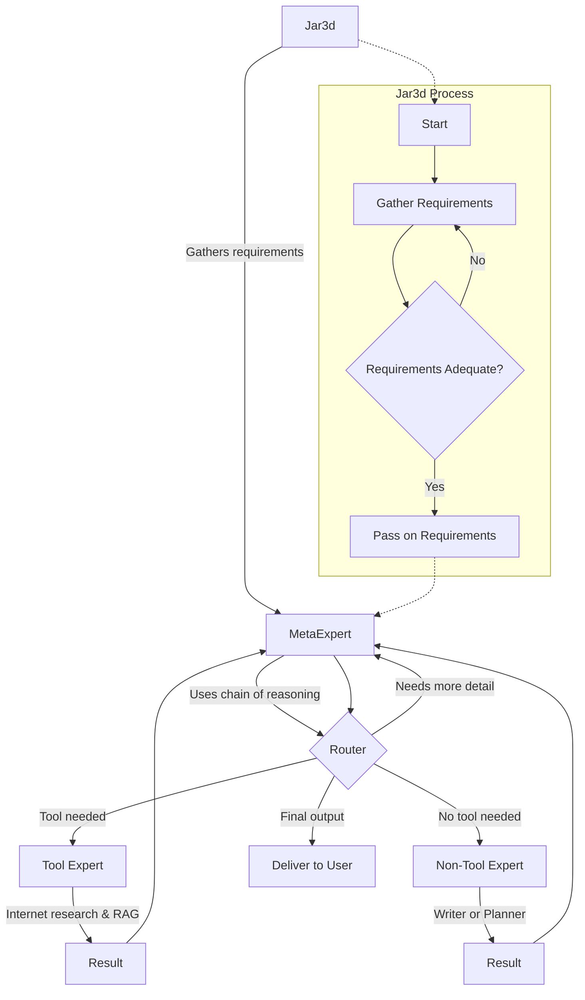

# Introduction to Jar3d

## Problem Statement
The goal was to develop an AI agent capable of leveraging the full potential of both proprietary and open-source models for research-intensive tasks.

## What is Jar3d?
Jar3d is a versatile research agent that combines [chain-of-reasoning](https://github.com/ProfSynapse/Synapse_CoR), Meta-Prompting, and Agentic RAG techniques.

- It features integrations with popular providers and open-source models, allowing for 100% local operation given sufficient hardware resources.
- Research is conducted via the SERPER API giving the agent access to google search, and shopping with plans to extend this to include other services.

### Use Cases & Applications
- Long-running research tasks, writing literature reviews, newsletters, sourcing products etc.
- Potential adaptation for use with internal company documents, requiring no internet access.
- Can function as a research assistant or a local version of services like Perplexity.

For setup instructions, please refer to the [Setup Jar3d](https://github.com/brainqub3/meta_expert) guide.

## Prompt Engineering
Jar3d utilizes two powerful prompts written entirely in Markdown:
1. [Jar3d Meta-Prompt](https://github.com/brainqub3/meta_expert/blob/main/prompt_engineering/jar3d_meta_prompt.md)
2. [Jar3d Requirements Prompt](https://github.com/brainqub3/meta_expert/blob/main/prompt_engineering/jar3d_requirements_prompt.md)

Both prompts incorporate adaptations of the Chain of Reasoning technique.

## Jar3d Architecture
The Jar3d architecture incorporates aspects of Meta-Prompting, Agentic RAG, and an adaptation of [Chain of Reasoning](https://github.com/ProfSynapse/Synapse_CoR).

## Jar3d's Retrieval Mechanism for Internet Research

This system employs a sophisticated retrieval mechanism for conducting internet research. The process involves several steps, utilizing various tools and techniques to ensure comprehensive and relevant results.

### 1. Web Page Discovery

- Utilizes the SERPER tool to find relevant web pages.
- Employs an LLM-executed search algorithm, expressed in natural language.
- Each iteration of the algorithm generates a search query for SERPER.
- SERPER returns a search engine results page (SERP).
- Another LLM call selects the most appropriate URL from the SERP.
- This process is repeated a predetermined number of times to compile a list of URLs for in-depth research.

### 2. Content Extraction and Chunking

- Employs [LLM Sherpa](https://github.com/nlmatics/llmsherpa) as a document ingestor.
- Intelligently chunks the content from each URL in the compiled list.
- Results in a corpus of chunked text across all accumulated URLs.

### 3. Text Embedding

- Embeds the chunked text using a locally hosted model from [FastEmbed](https://qdrant.github.io/fastembed/#installation).
- Indexes embeddings in an in-memory [FAISS](https://api.python.langchain.com/en/latest/vectorstores/langchain_community.vectorstores.faiss.FAISS.html) vector store.

### 4. Similarity Search

- Performs retrieval using a similarity search over the FAISS vector store.
- Utilizes cosine similarity between indexed embeddings and the meta-prompt (written by the meta-agent).
- Retrieves the most relevant information based on this similarity measure.

### 5. Re-ranking

- Leverages [FlashRank](https://github.com/PrithivirajDamodaran/FlashRank) as a locally hosted re-ranking service.
- FlashRank uses cross-encoders for more accurate assessment of document relevance to the query.

### 6. Final Selection

- Selects a designated percentile of the highest-scoring documents from the re-ranked results.
- Passes this final set of retrieved documents to the meta-agent for further processing or analysis.