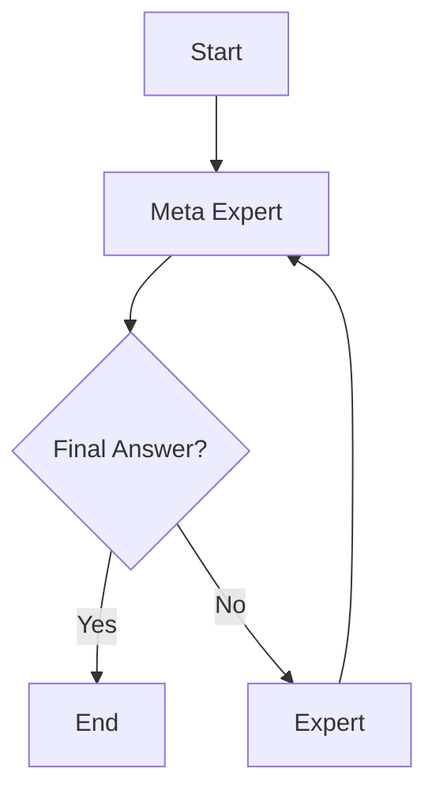

#metaprompting #AI #agents #customGPT #YouTubeTopic #backed
#promptengineering
These notes are derived from [Source](https://arxiv.org/abs/2401.12954)
## What is Meta-Prompting?
A scaffolding technique that turns a single LLM into an orchestrator managing multiple specialised LLMs. You do not need to prompt each specialist because you're prompting the orchestrator to create prompts! 
## Key Aspects of Meta-Promoting
* Decisions about which prompts to use and which codes to execute are left solely in the hands of the LLM.
* Been shown to beat other task agnostic scaffolding methods.
* Meta-prompting has four parts:
	1. Break down complex tasks into smaller pieces.
	2. Assign these pieces to specialised expert models.
	3. Oversee the communication between these expert models.
	4. Apply its own critical thinking, reasoning, and verification skills.

* Meta-prompting is task agnostic.
* Enhanced with an interpreter.
	1. Meta prompting has shown to be powerful when combined with an interpreter. More on code interpreters here: [[OS Code Interpreter]]

## What the Research Says

### Strengths
Through rigorous experimentation with GPT-4, meta-prompting, enhanced by Python interpreter functionality, has been shown to outperform conventional scaffolding methods. On average, it surpasses standard prompting by 17.1%, expert (dynamic) prompting by 17.3%, and multipersona prompting by 15.2% across tasks such as the Game of 24, Checkmate-in-One, and Python Programming Puzzles.

### Weaknesses
Here are the main weaknesses of the meta-prompting framework, based on the provided text:

* Cost inefficiency: Multiple model calls, especially with GPT-4, lead to high operational costs.
* Scalability issues: Requires large-scale models with extensive context windows, limiting use with smaller models.
* Linear operation: Sequential processing of steps limits parallel processing capabilities, affecting speed and efficiency.
* Domain restrictions: Current implementation is limited to closed-domain systems, though potential exists for expansion.
* Information transfer challenges: The Meta Model sometimes fails to effectively communicate necessary information to expert models.
* Response patterns: Tendency for apologetic responses in lower-performing tasks, likely due to training on instruction-following data.
* Limited parallelism: Current design doesn't allow for simultaneous expert consultations or varied parameter usage within a single expert.
* Context management: Lack of efficient history summarization or refinement between steps.
* Model dependency: Heavy reliance on advanced models limiting effectiveness with smaller language models.

*Author Note: I wonder how many of these weaknesses are still applicable with the more advanced models that have been released since the research on meta-prompting was conducted.*

These bullet points summarize the key limitations and challenges faced by the meta-prompting framework as described in the text.

[Source](https://arxiv.org/abs/2401.12954)

## Meta Prompting with Web Search

Using meta-prompting to build a web search agent. #agents #metaprompting

**Libs and Frameworks**
* Uses [LangGraph](https://langchain-ai.github.io/langgraph/) for orchestration of agents.

**Agent Schema:**
Just three agents required.
- Meta Expert: The Meta Expert agent.
- No Tool Expert: The agents that receive non-tool instructions.
- Tool Expert: The agent that receives tool based instructions such as (search the internet)

**The Prompt**
The Meta-Prompt is written in Mark Down. This makes it much easier to read and allows a standardized way of writing prompts that most LLMs should understand. Explore the [[Meta-Prompt]]

# Watch the Video

