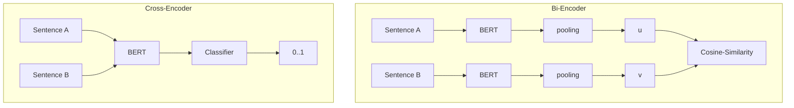

#RAG #agents 

## Core Components of Agentic RAG

Agentic RAG has **two** core components.
1. Dynamic planning and execution
	1. The agentic strategy we use to plan and execute against a user query we receive.
2. Retrieval pipeline
	1. Document parsing and chunking strategy: How we extract text from various document types and chunk them into smaller sub-documents.
	2. Embedding models: The models we use to transform the sub-documents into numeric vector representations that we can store in vector databases and retrieve later on.
	3. Document retrieval strategy: The strategy we use to retrieve the sub-documents to answer queries.
### Dynamic Planning and Execution 
- [LangGraph](https://langchain-ai.github.io/langgraph/) uses a computational graph to execute agentic workflows.
- 

### Retrieval Pipeline
Retrieval pipeline will consist of a document parser, an embedding model, and a similarity metric (for which we retrieve our embeddings).
#### Document Parsing & Chunking Strategy
Document parsing should have the following:
- Flexibility: Handles a range of document types including pdf, html, txt etc.
- Structurally Aware: Must be able to parse documents such that the structure of the document is preserved. This will include things like preserving tables.
- 
#### Embedding & Retrieval Strategy

[Source](https://www.sbert.net/examples/applications/cross-encoder/README.html)

Sentence embedding models come in two flavours, [bi-encoders and cross-encoders](https://www.sbert.net/examples/applications/cross-encoder/README.html). 
* Bi-Encoders: Produce separate sentence embedding  for each input text. They are **faster** but **less accurate** than cross encoders. Useful for semantic search, or Information retrieval due to the efficiency,
* Cross-Encoders: Process pairs of sentences together to produce a similarity score. They are **slower**, but **more accurate** than bi-encoders. Use For small pre-defined data sets, cross encoders can be useful.

It's common practice to combine bi-encoders and cross-encoders in a multi-stage approach. The bi-encoders will help produce the initial retrieval candidates. The cross encoders are used to re-rank top candidates for higher accuracy.

### Knowledge Graph Retrieval

In Hybrid Mode, Jar3d creates a Neo4j knowledge graph from the ingested documents. We have found that combining KG retrieval with RAG improves it's ability to answer more complex queries.

We leverage an [LLM Graph Transformer](https://api.python.langchain.com/en/latest/graph_transformers/langchain_experimental.graph_transformers.llm.LLMGraphTransformer.html) to create a knowledge graph from the documents.

We query the knowlede graph using Cypher Query Language to isolate the most relevant relationhips and nodes. This retireved context is fed into the LLM alongside the context retrievd from the similarity search and reranking with the cross-encoder.

### Tooling

**LLM Sherpa** - Open Source
Covers document parsing

[LLM Sherpa](https://github.com/nlmatics/llmsherpa): Handles a variety of documents and provides some structural awareness. Allows self hosting via the [backend service](https://github.com/nlmatics/nlm-ingestor) which is fully open sourced. LLM Sherpa does smart chunking which preserves the integrity of text by keeping related text together.  Research suggests that it struggles with more complex PDF doc types.
Platforms:

##### Tools for Embedding
[Langchain integrations](https://python.langchain.com/v0.1/docs/integrations/text_embedding/) make it easy to leverage a variety of embedding model services.
* For bi-encoders [FastEmbed by Qdrant](https://python.langchain.com/v0.1/docs/integrations/text_embedding/fastembed/) is fast and lightweight (good for PoCs, search apps). 
* For re-ranking with Cross-Encoders, [Langchain provides](https://python.langchain.com/v0.2/docs/integrations/document_transformers/cross_encoder_reranker/) a variety of options.