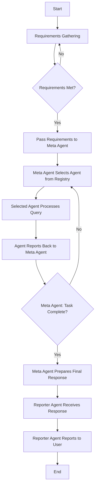

## Overview

Jar3d is a Meta Agent built on LangGraph that can orchestrate a team of agents to complete basic tasks. 

The agent team includes:

- Google Search Agent
- Google Shopping Agent
- Web Scraper Agent
- RAG Agent

**The agent team can be extended by adding additional tool using agents to the project.**

Jar3d can perform basic tasks like product sourcing, writing newsletters, creating itineraries, and essentially anything that can be reasonably done with the team of agents listed above.

## Table of Contents

1. [Core Concepts](#core-concepts)
2. [Prerequisites](#prerequisites)
3. [Configuration](#configuration)
4. [Setup](#setup)
5. [Usage](#usage)
6. [Roadmap](#roadmap)
7. [Further Reading](#further-reading)
8. [Integrations](#integrations)
9. [Features on the Roadmap](#features-on-the-roadmap)

## Core Concepts

Jar3d functions as a meta-agent system, orchestrating various agents to achieve complex goals. The system comprises four primary agent types:

1. **Meta Agent**: Central orchestrator coordinating other agents' activities.
2. **Tool Agent**: Interfaces with specific tools or services for specialized tasks.
3. **Reporter Agent**: Communicates results and updates to the user.
4. **Requirements Gathering Agent**: Refines and clarifies project requirements through user interaction.

### Key Techniques

- **Meta Prompting**: Leverages advanced prompting techniques for improved performance.
- **Chain of Reasoning**: Adapts the Chain-of-Reasoning approach for more coherent outputs.
- **Retrieval Augmented Generation (RAG)**: Enhances responses with relevant contextual information.
- **Knowledge Graph Generation**: Creates comprehensive knowledge graphs from web pages.

### System Workflow

1. Users interact with the Requirements Gathering Agent to define project goals.
2. Finalized requirements are passed to the Meta Agent.
3. The Meta Agent orchestrates Tool Agents to accomplish the goal.
4. Results are passed to the Reporter Agent for user communication.

#### Workflow Diagram



## Prerequisites

1. Git
2. Docker and Docker Compose
3. (Optional) Neo4j Aura account for Hybrid Retrieval

## Configuration

1. Clone the repository:
   ```bash
   git clone https://github.com/brainqub3/meta_expert.git
   cd meta_expert
   ```

2. Configure `config/config.yaml`:
   - Set API keys for chosen LLM providers (Serper, OpenAI, Gemini, Claude, Groq)
   - Choose inference provider by setting `LLM_SERVER` (e.g., claude, openai, groq)

**Note**: Keep your `config.yaml` file private as it contains sensitive information.

## Setup

### Confgurations

Setup the configurations for the project in the `config/config.yaml` file.

   - **Serper API Key:** Get it from [https://serper.dev/](https://serper.dev/)
   - **OpenAI API Key:** Get it from [https://openai.com/](https://openai.com/)- Advised Model
   - **Gemini API Key:** Get it from [https://ai.google.dev/gemini-api](https://ai.google.dev/gemini-api) - Not currently supported
   - **Claude API Key:** Get it from [https://docs.anthropic.com/en/api/getting-started](https://docs.anthropic.com/en/api/getting-started)
   - **Groq API Key:** Get it from [https://console.groq.com/keys](https://console.groq.com/keys) - Not currently supported

### Docker Setup

1. Ensure Docker daemon is running.
2. Build and start containers:
   ```bash
   docker-compose up --build
   ```
3. Access Jar3d web interface at `http://localhost:8000`.

To stop the service:
```bash
docker-compose down
```

## Usage

1. Access the Jar3d web interface.
2. Jar3d will introduce itself and ask questions to refine your requirements.
3. Type `/end` when you've provided all relevant information.
4. Submit feedback using the `/feedback` tag.

## Roadmap

- Integration with Ollama, vLLM, and other LLM providers
- Enhanced memory management
- Improved document processing and RAG capabilities

## Further Reading

To deepen your understanding of the concepts and technologies used in Jar3d, we recommend the following resources:

- [Meta-Prompting Overview](Docs/Meta-Prompting%20Overview.MD): Our concise notes on the meta-prompting technique.
- [Introduction to Jar3d](Docs/Introduction%20to%20Jar3d.MD): A detailed introduction to the Jar3d system.
- [Overview of Agentic RAG](Docs/Overview%20of%20Agentic%20RAG.MD): Our notes on Retrieval Augmented Generation in the context of AI agents.
- [Meta-Prompting Paper](https://arxiv.black/pdf/2401.12954): The original research paper on meta-prompting techniques.
- [Chain-of-Reasoning GitHub](https://github.com/ProfSynapse/Synapse_CoR): The original implementation of the Chain-of-Reasoning concept.

For the latest updates and detailed documentation, please refer to our [GitHub repository](https://github.com/brainqub3/meta_expert).

## Integrations

- Jar3d integrates with [LangSmith](https://www.langchain.com/langsmith) for observability.
  - Monitor flows through the agent graph.
  - Debug applications.

## Features on the Roadmap

- Memory management
- Support for Ollama
- Support for vLLM
- Support for Gemini
- Support for Groq
- Support for Mistral
- Include Google Places and Maps Agents
- Include Neo4J Graph Agent Generator